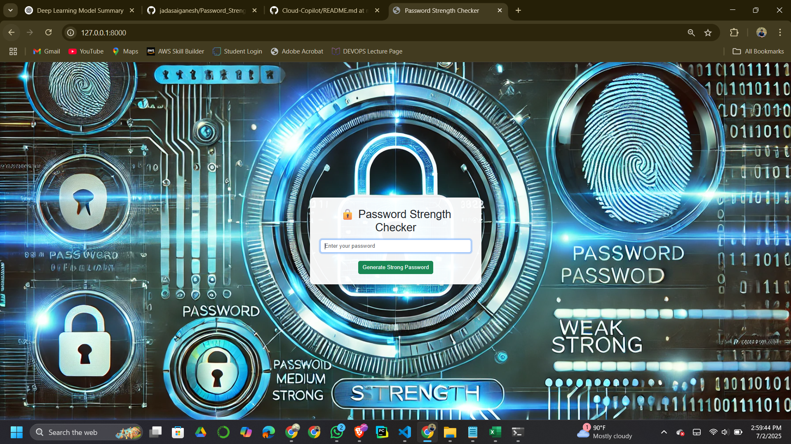
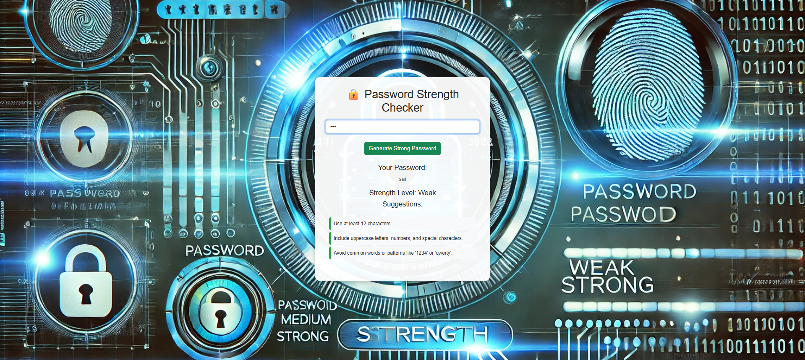

# 🔐 Password Strength Checker Web App

A secure and intelligent **Password Strength Checker** built with **Django** and **Bootstrap**, designed to help users evaluate and enhance the strength of their passwords based on modern security guidelines and Indian-specific patterns.

---

## 🚀 Features

- 🔍 **Real-Time Password Evaluation**
  - Instant feedback on password strength (Weak, Medium, Strong)
  - Highlights vulnerabilities such as names, places, mobile numbers, and Aadhaar-like patterns

- 💡 **Smart Suggestions**
  - Displays actionable security suggestions dynamically
  - Identifies weak password constructs common to Indian users

- 🔒 **Secure Practices**
  - CSRF-protected AJAX-based communication
  - Strong backend validation using regex and logic rules

- ⚙️ **Strong Password Generator**
  - Creates robust passwords combining uppercase, lowercase, digits, and symbols

- 🎨 **Responsive UI**
  - Clean, modern Bootstrap interface with real-time updates

---

## 🛠️ Tech Stack

- **Backend**: Django (Python)
- **Frontend**: HTML5, CSS3, Bootstrap 5
- **Communication**: Fetch API (AJAX)
- **Security**: CSRF protection, server-side validation

---

## 📁 Project Structure

```
password_checker/
├── checker/
│ ├── templates/checker/index.html
│ ├── static/images/bg4.webp
│ ├── views.py
│ ├── urls.py
│ └── ...
├── password_checker/
│ └── settings.py
├── manage.py
└── README.md
```
---


## 🧠 Password Evaluation Criteria

### ✅ Strong
- ≥ 12 characters
- Includes uppercase, lowercase, digit, and special character
- No repeated sequences or known patterns

### ⚠️ Medium
- ≥ 8 characters
- Contains at least 2 of the 4: uppercase, lowercase, number, special

### ❌ Weak
- < 8 characters
- Common names, numbers, or patterns
- Indian-specific weak data like names, cities, Aadhaar, PAN, phone numbers

---

## 🧪 API Usage

**Endpoint:**  
`POST /checker/check-password/`

**Request Body:**  
`password=yourPassword123!`

**Response:**
```json
{
  "strength": "Medium",
  "suggestions": [
    "Consider making your password longer (12+ characters).",
    "Include a mix of uppercase, numbers, and special characters."
  ]
}
```
---
## ⚙️ Run Locally

### Clone the Repository

```bash
git clone https://github.com/jadasaiganesh/Password-Strength-Checker.git
cd Password-Strength-Checker
```

###Create Virtual Environment & Install Dependencies
```
python -m venv venv
source venv/bin/activate  # On Windows: venv\Scripts\activate
pip install -r requirements.txt
```
### Run the Django Server
```
python manage.py runserver
```
#### Open browser at:
```
 http://127.0.0.1:8000/
```
---

## 📷 UI Preview




---

## 📈 Future Scope

- 🔗 **Integrate breach check using [HaveIBeenPwned API](https://haveibeenpwned.com/API)**  
  Check if the entered password has appeared in any known data breaches.

- 🔐 **Add login + vault to store user passwords (encrypted)**  
  Implement user authentication and a secure password manager with encryption.

- 📱 **Fully mobile-responsive UX**  
  Optimize the interface for seamless usage on all mobile devices.

- 🌍 **Support multilingual suggestions**  
  Provide password feedback and suggestions in multiple languages.
---

## 🙋‍♂️ Author

**Sai Ganesh J**  
📧 **Email**: [jadasaireddy@gmail.com](mailto:jadasaireddy@gmail.com)  
🔗 **GitHub**: [@jadasaiganesh](https://github.com/jadasaiganesh)

---
